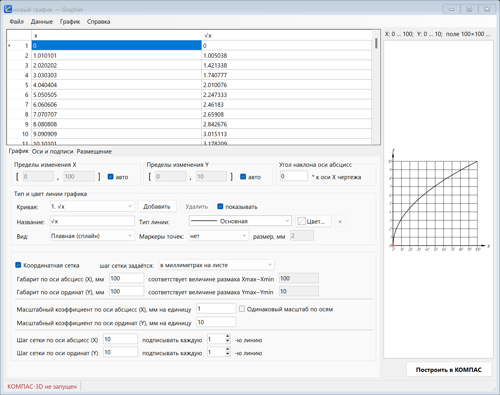
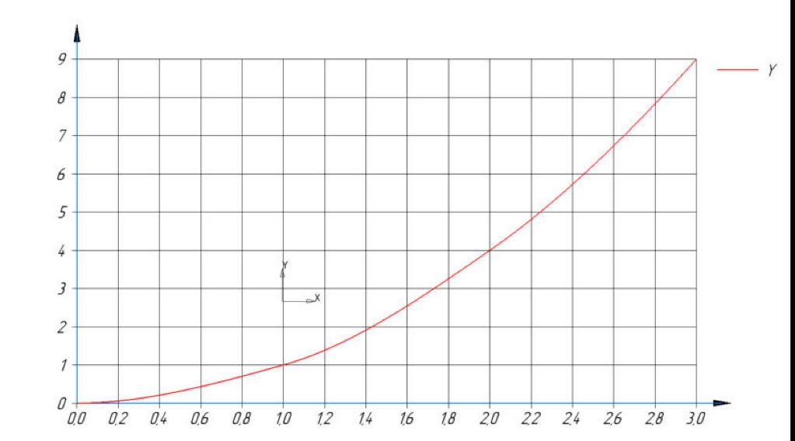

# Grapher — графики по точкам для КОМПАС-3D

Grapher переносит графики из Mathcad 15 и Excel на чертёж КОМПАС-3D. На входе — таблица
точек (X, Y), на выходе — график в активном чертеже или фрагменте: оси со стрелками, сетка,
числовые подписи и кривые. Всё рисуется объектами КОМПАС (отрезки, кривые Безье, тексты)
и объединяется в один макроэлемент, поэтому график векторный, редактируется и печатается
как обычная геометрия чертежа.

Это аналог библиотеки FT Draw, только для графиков по точкам, а не по формуле: вместо поля
формулы — таблица данных, ниже те же блоки настроек.



Результат в КОМПАС (кривая со своим цветом линии):



## Возможности

- Таблица X и одного или нескольких столбцов Y; у каждой кривой своё название, тип линии
  КОМПАС, цвет, вид (плавная или ломаная) и маркеры.
- Вставка из буфера обмена (Mathcad, Excel), импорт `.xlsx`, `.xls`, `.csv`, `.txt`, `.prn`
  без установленного Excel. Десятичный разделитель — точка или запятая.
- Автоматические или ручные пределы осей с точной обрезкой кривых по рамке.
- Размер графика в миллиметрах или масштабные коэффициенты, одинаковый масштаб по осям.
- Сетка, оси, засечки, числа, подписи осей вида «σ, МПа», шрифт по ГОСТ 2.304.
- Точка вставки курсором или по координатам, угол наклона, легенда.
- Предпросмотр в окне программы совпадает с тем, что будет на чертеже.
- Работает как отдельная программа и как пункт меню «Приложения» в КОМПАС.

## Установка

Готовый пакет — архив `Grapher-<версия>.zip` на странице
[Releases](https://github.com/gbirkin3005/Grapher-Kompas/releases). Коротко:

1. Распакуйте архив и запустите `install.cmd`. Права администратора не нужны.
2. В КОМПАС-3D: «Приложения» → «Добавить приложения…» → вкладка «ActiveX» →
   `GrapherKompas.Library` → «Открыть».
3. В меню «Приложения» появится пункт «Grapher» → «Построить график…».

Подробная инструкция с разбором возможных проблем: [docs/INSTALL.md](docs/INSTALL.md).

Требования: Windows 10/11 x64, КОМПАС-3D (проверено на v25, учебная версия),
.NET Framework 4.8 (входит в Windows 10 версии 1903 и новее и в Windows 11).

## Как пользоваться

Руководство пользователя: [docs/USAGE.md](docs/USAGE.md) — перенос данных из Mathcad,
таблица, импорт, настройки, особенности плавной кривой, ограничения.

## Сборка из исходного кода

Нужны .NET SDK 8 или новее (либо Visual Studio 2022 и новее) и установленный КОМПАС-3D
вместе с SDK.

```
.\build.cmd
```

Скрипт запускает тесты и складывает готовые файлы в папку `dist`:

| Что | Где |
|---|---|
| Приложение | `dist\Grapher\Grapher.exe` |
| Библиотека КОМПАС | `dist\GrapherKompas.Library\GrapherKompas.Library.dll` |

Interop-сборки КОМПАС (`KompasAPI7.dll`, `Kompas6API5.dll`, `Kompas6Constants.dll`,
`KAPITypes.dll`) принадлежат АСКОН и в репозитории не хранятся. При первой сборке `build.cmd`
сам копирует их в `lib\kompas` из установленного КОМПАС (`<КОМПАС>\SDK\Samples\CSharp.zip`,
папка `Common`) скриптом `tools\get-kompas-interop.ps1`. Они нужны только при сборке: типы
встраиваются в `Grapher.Kompas.dll`.

В Visual Studio откройте `GrapherKompas.sln`; запускаемый проект — `Grapher.App`.

Чтобы проверить библиотеку из папки `dist` без установки пакета:

1. `tools\register-library.cmd` — регистрирует `dist\GrapherKompas.Library` для текущего
   пользователя (ветка реестра `HKCU\Software\Classes`, права администратора не нужны).
2. В КОМПАС подключите `GrapherKompas.Library`, как описано в разделе «Установка».
3. Отмена регистрации — `tools\unregister-library.cmd`.

Пока КОМПАС запущен, файлы библиотеки заняты: перед пересборкой закройте КОМПАС.

`tools\register-library-all-users.cmd` регистрирует библиотеку для всех пользователей
компьютера через RegAsm (нужны права администратора). Этот вариант не проверялся.

## Выпуск релиза

```
.\release.cmd
```

Скрипт `tools\make-release.ps1` запускает тесты, собирает приложение и библиотеку и создаёт
`dist\release\Grapher-<версия>.zip`. Версия берётся из `Directory.Build.props`. В пакет
входят программа и библиотека (в одной папке), установщик (`installer\install.cmd`,
`uninstall.cmd`, `setup.ps1`), примеры данных и документация из `docs` в виде текстовых
файлов.

## Устройство

| Проект | Назначение |
|---|---|
| `Grapher.Core` (netstandard2.0) | Модели, разбор чисел и таблиц, проверка данных, «красивые» засечки, масштаб, обрезка по рамке, интерполяция, прореживание, импорт, проект JSON. Результат — список абстрактных примитивов (отрезок, ломаная, сплайн, окружность, текст). От КОМПАС не зависит. |
| `Grapher.Kompas` | Рендерер КОМПАС: подключение через COM и перевод примитивов в объекты чертежа. |
| `Grapher.UI` | Окна и рендерер предпросмотра (GDI+): рисует те же примитивы. |
| `Grapher.App` | Исполняемый файл `Grapher.exe`. |
| `Grapher.KompasLibrary` | Обёртка-библиотека для запуска из меню КОМПАС. |
| `Grapher.Core.Tests` | 241 тест ядра (xUnit). |

Используется API КОМПАС версии 7 (`IDrawingContainer`, `ILineSegment`, `IPolyLine2D`, `IBezier`,
`IDrawingText`, `IMacroObject`, `IStyles`). API версии 5 нужен только для запроса точки
курсором (`ksCursor`).

Цвет линии. У объектов чертежа КОМПАС нет собственного цвета — он задаётся стилем линии.
Для кривой со своим цветом в документе создаётся стиль «Grapher: <тип линии> #RRGGBB»
с толщиной и штрихами системного стиля. Стиль создаётся с нуля (`IStyles.Add`): метод
`IStyles.Copy` для системного стиля использовать нельзя — «копия» остаётся связанной
с оригиналом, и смена её цвета перекрашивает сам системный стиль (проверено на v25).

Сторонние библиотеки: ExcelDataReader 3.7.0 (MIT), Newtonsoft.Json 13.0.3 (MIT) — тексты
лицензий в `THIRD-PARTY-NOTICES.txt`; для тестов — xUnit (Apache-2.0).

## Что проверено

На КОМПАС-3D v25 Учебная версия x64 (25.0.0.2735), Windows 11:

- Тесты ядра: 241 из 241.
- Построение контрольного примера (y = √x, 100 точек, поле 100×100 мм, сетка 10 мм, плавная
  кривая) во фрагмент, в чертёж, в вид с масштабом 1:2 и с поворотом на 30°. После каждого
  построения координаты всех объектов прочитаны обратно из КОМПАС и сравнены со сценой,
  из которой рисуется предпросмотр: расхождение 0 мм.
- Группировка: в дереве чертежа график — один макроэлемент; щелчок по любой линии выделяет
  график целиком.
- Вставка текста с табуляцией и десятичной запятой, импорт `.xlsx`, `.xls`, `.csv`, `.txt` —
  дают тот же график, что и контрольный пример.
- Цвет линии: кривые со своим цветом построены и прочитаны обратно (стиль и цвет совпали).
  Цвета системных стилей КОМПАС до и после построения, а также после перезапуска КОМПАС
  одинаковы.
- Релизный пакет 1.1.0, на той же машине, где он собран: архив распакован во временную
  папку, запущен `install.cmd`; проверены файлы, записи реестра, ярлыки и запись в списке
  приложений. В КОМПАС библиотека подключена по инструкции (вкладка «ActiveX»), в меню
  появился пункт «Grapher», окно открылось из папки установки. В нём данные введены
  с клавиатуры, цвет выбран кнопкой «Цвет…», график построен с указанием точки мышью.
  `uninstall.cmd` при открытом КОМПАС отказывается удалять программу, при закрытом — удаляет
  файлы, ярлыки и регистрацию.

Не проверялось:

- Установка на другом компьютере и на «чистой» Windows; Windows 10; другие версии КОМПАС.
- Предупреждения Windows при запуске файлов, действительно скачанных из Интернета,
  и удаление через «Параметры» Windows (проверен только запуск `uninstall.cmd`).
- Копирование из самого Mathcad 15: проверен разбор текста того же вида (табуляция, запятая),
  но не буфер обмена реального Mathcad.
- Ctrl+V из настоящего буфера обмена и диалог выбора файла: вставка и импорт проверялись
  через те же функции, которые вызывают команды меню.
- Регистрация библиотеки для всех пользователей (RegAsm, с правами администратора).
- Печать чертежа.

### Чек-лист ручной проверки

1. Запустите `Grapher.exe` при закрытом КОМПАС, нажмите «Построить в КОМПАС» — должно
   появиться предложение запустить КОМПАС, затем создать чертёж или фрагмент.
2. «Файл» → «Импорт из Excel/CSV…» → `samples\sqrt.xlsx` → «Построить в КОМПАС» → щелчок
   на чертеже. При габарите 100×100 мм и шаге сетки 10: сетка 10×10 клеток, числа 0…100
   и 0…10.
3. Щёлкните по графику в КОМПАС: он выделяется целиком, перемещается и удаляется как один
   объект. Ctrl+Z убирает его за один шаг.
4. Скопируйте содержимое `samples\sqrt.txt`, в приложении «Файл» → «Новый» → Ctrl+V.
   График тот же.
5. Скопируйте таблицу из Mathcad 15 и вставьте её.
6. Задайте пределы X вручную 0…50: кривая должна обрываться точно на правой стороне рамки.
7. Измените габарит X — меняется коэффициент; измените коэффициент — меняется габарит.
8. Кнопкой «Цвет…» задайте кривой цвет и постройте график: кривая на чертеже того же цвета,
   остальные линии чертежа цвет не изменили.
9. Сохраните проект, выберите «Новый», откройте проект — данные и настройки на месте.
10. Распечатайте чертёж или сохраните в PDF: линии и шрифт как у остальной графики чертежа.
11. В КОМПАС: «Приложения» → «Grapher» → «Построить график…» — открывается то же окно;
    постройте график из него.

## Служебные ключи

Для проверки без ручных действий у `Grapher.exe` есть ключи командной строки
(результат пишется в файл, указанный после `--log`):

```
Grapher.exe --draw sample --new-drawing --x 50 --y 120 --verify --png out.png --log out.log
Grapher.exe --draw график.graph.json --angle 30 --verify --log out.log
Grapher.exe --preview-png sample preview.png
Grapher.exe --make-samples samples
```

`--verify` читает построенные объекты обратно из КОМПАС и сравнивает их со сценой.
