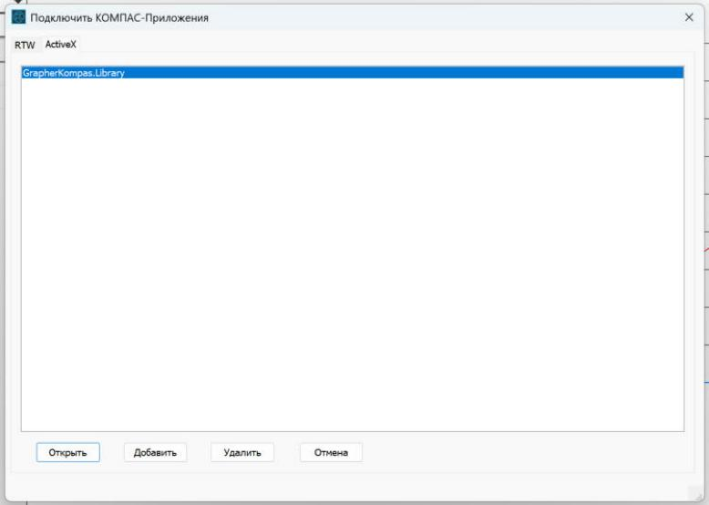

# Установка Grapher

Grapher строит графики по точкам в чертежах и фрагментах КОМПАС-3D. После установки
им можно пользоваться двумя способами:

- как отдельной программой — ярлык «Grapher» в меню «Пуск» и на рабочем столе;
- прямо из КОМПАС — меню «Приложения» → «Grapher» → «Построить график…».

Оба способа открывают одно и то же окно и строят одинаковые графики.

## Что нужно

- Windows 10 или Windows 11, 64-разрядная.
- КОМПАС-3D. Программа проверена на КОМПАС-3D v25 (учебная версия); на других версиях
  она не проверялась.
- .NET Framework 4.8. В Windows 10 (начиная с версии 1903) и в Windows 11 он уже есть.

Права администратора не нужны. Excel и Mathcad тоже не нужны.

## Установка

1. Возьмите архив `Grapher-<версия>.zip` — со страницы Releases репозитория
   https://github.com/gbirkin3005/Grapher-Kompas/releases или у того, кто вам его передал.

2. Распакуйте архив: щёлкните по нему правой кнопкой мыши и выберите «Извлечь всё…».
   Запускать файлы прямо из архива нельзя.

3. Откройте распакованную папку и дважды щёлкните по файлу `install.cmd`.

   Windows может показать предупреждение, потому что файл скачан из Интернета и не имеет
   цифровой подписи. Нажмите «Запустить», а если появилось синее окно «Система Windows
   защитила ваш компьютер» — «Подробнее» → «Выполнить в любом случае».

   Откроется чёрное окно, в котором через несколько секунд появится надпись
   «Grapher установлен». Закройте его любой клавишей.

4. Подключите Grapher в КОМПАС. Это делается один раз:

   1. Запустите КОМПАС-3D. Если он был открыт во время установки, перезапустите его.
   2. Откройте меню «Приложения» и выберите «Добавить приложения…».
   3. Откроется окно «Подключить КОМПАС-Приложения». Перейдите в нём на вкладку «ActiveX»,
      щёлкните по строке `GrapherKompas.Library` и нажмите «Открыть».
   4. В меню «Приложения» появится пункт «Grapher», а в нём — команда «Построить график…».

Распакованную папку и архив после этого можно удалить: программа скопирована в папку
`%LOCALAPPDATA%\Programs\Grapher` (обычно это `C:\Users\<имя>\AppData\Local\Programs\Grapher`).

Что делает `install.cmd`:

- копирует программу в папку `%LOCALAPPDATA%\Programs\Grapher`;
- регистрирует библиотеку КОМПАС для текущего пользователя Windows
  (ветка реестра `HKCU\Software\Classes`);
- создаёт ярлыки «Grapher» в меню «Пуск» и на рабочем столе;
- добавляет Grapher в список установленных приложений Windows.

Больше в системе ничего не меняется. Регистрация действует только для той учётной записи
Windows, под которой запущен `install.cmd`. Если компьютером пользуются несколько человек,
каждый запускает `install.cmd` под своей учётной записью.

## Проверка

1. В КОМПАС откройте или создайте чертёж или фрагмент.
2. Выберите «Приложения» → «Grapher» → «Построить график…».
3. Введите в таблицу несколько точек, например X: 0, 1, 2, 3 и Y: 0, 1, 4, 9
   (переход в следующую ячейку — клавиша Tab). Справа появится предпросмотр графика.
4. Нажмите «Построить в КОМПАС» (или F5) и щёлкните мышью на чертеже.

На чертеже должен появиться график с осями, сеткой и числами. Щелчок по любой его линии
выделяет график целиком: он построен как один макроэлемент.

Готовые примеры данных лежат в папке `samples` (в распакованном архиве и в папке программы):
`sqrt.xlsx`, `sqrt.csv` и `sqrt.txt` — 100 точек функции y = √x. Они открываются командой
«Файл» → «Импорт из Excel/CSV…».

Как вводить свои данные и настраивать оформление, написано в руководстве пользователя
(в архиве это файл «Руководство.txt», в репозитории — `docs/USAGE.md`).

## Запуск без установки

Отдельная программа работает и без установки: достаточно распаковать архив и запустить
`Grapher.exe`. КОМПАС при этом должен быть установлен. Пункта в меню «Приложения» в таком
случае не будет — он появляется только после `install.cmd`.

## Обновление

Установите новую версию так же, поверх старой: распакуйте архив и запустите `install.cmd`.
Перед этим закройте КОМПАС и Grapher, иначе файлы программы будут заняты. Подключать
Grapher в КОМПАС заново не нужно.

## Удаление

1. В КОМПАС уберите Grapher из списка приложений: откройте «Приложения» → «Конфигуратор…»,
   раскройте в списке группу «Приложения», выберите Grapher и нажмите «Исключить
   из конфигурации». Закройте конфигуратор.
2. Закройте КОМПАС.
3. Откройте «Параметры» Windows → «Приложения» → «Установленные приложения», найдите Grapher
   и выберите «Удалить». То же самое делает файл `uninstall.cmd` в папке программы.

Удаляются папка программы, ярлыки и регистрация библиотеки. Ваши настройки остаются
в папке `%AppData%\Grapher`; если они не нужны, удалите её вручную.

## Если что-то не получилось

**`install.cmd` пишет «Рядом с этим файлом нет программы Grapher».**
Файл запущен прямо из архива. Распакуйте архив («Извлечь всё…») и запустите `install.cmd`
из распакованной папки.

**`install.cmd` пишет «Файл … занят».**
Закройте КОМПАС-3D и Grapher и запустите `install.cmd` ещё раз.

**На вкладке «ActiveX» нет строки `GrapherKompas.Library`.**

- Проверьте, что `install.cmd` дошёл до надписи «Grapher установлен».
- `install.cmd` нужно запускать под той же учётной записью Windows, под которой вы работаете
  в КОМПАС.
- Если КОМПАС запущен «от имени администратора», он может не видеть регистрацию текущего
  пользователя. Запустите КОМПАС обычным образом.

**Пункт «Grapher» в меню есть, но окно не открывается.**
Закройте КОМПАС и запустите `install.cmd` ещё раз. Он заново записывает в реестр путь
к программе и снимает с её файлов отметку «получено из Интернета», которая может мешать
загрузке библиотеки. Так же поступите, если вы переместили или переименовали папку
программы.

**`Grapher.exe` не запускается и просит установить .NET Framework.**
Установите .NET Framework 4.8: https://dotnet.microsoft.com/download/dotnet-framework/net48

**На чертеже вместо букв квадратики.**
В выбранном шрифте нет нужных знаков или сам шрифт не установлен. Grapher по умолчанию
пишет шрифтом «GOST Type AU», который ставится вместе с КОМПАС-3D v25. Выберите другой
шрифт на вкладке «Оси и подписи».
